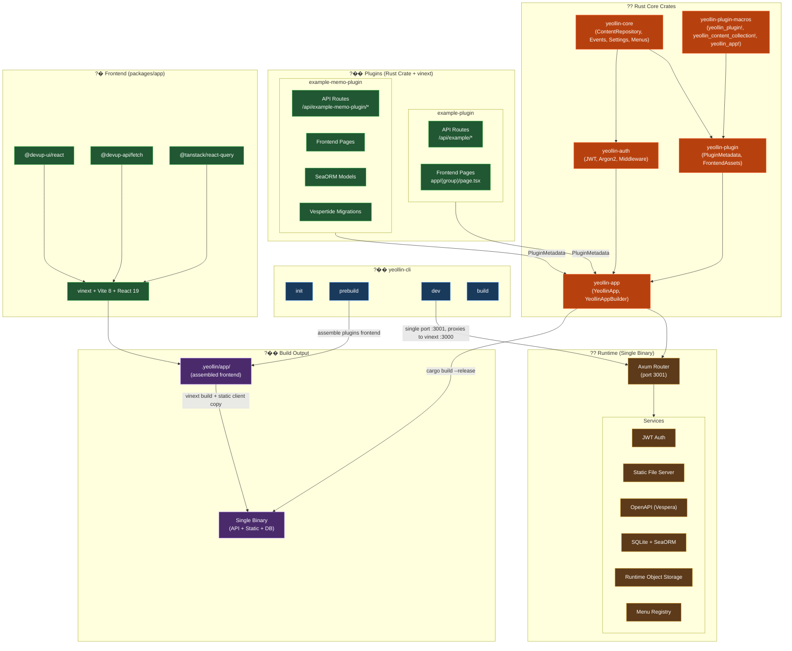

# Yeollin CMS Architecture

Rust + vinext plugin-based CMS framework. Plugins bundle API routes and frontend
pages in a single crate; `yeollin-cli` assembles them into one binary that serves
both the API and the statically exported frontend.

## Build flow

1. `cargo build` ??produces a binary that can export plugin/menu metadata via
   `YEOLLIN_EXPORT`, which prints one envelope on stdout and exits.
2. `yeollin prebuild` ??extracts the `packages/app` template into `.yeollin/app/`,
   copies each plugin's `app/` pages in, generates typed settings forms unless a
   plugin supplies `app/settings/page.tsx`, generates typed collection hubs and
   CRUD editors, and writes `menus.json` / `plugins.json`.
3. `vinext build` ??static export to `.yeollin/app/dist/client/`, then the CLI
   copies the client output to `.yeollin/app/out/`.
4. `cargo build --release` ??final binary, embedding static files via `include_dir!`.

## Dev mode

`yeollin dev` serves everything on a single port (3001). The Axum router handles
API routes and proxies everything else to the internal vinext dev server on 3000,
including the Vite HMR WebSocket at `/__vite_hmr`.

Framework-owned settings and event-outbox migrations run before plugin
initializers. The runtime then installs `SettingsStore` and `EventBus` Axum
extensions. Plugin writes use `EventTransaction`: action work, the event insert,
and Inline database-only subscribers share one transaction. Commit wakes the
Deferred drainer, while its independent poll loop recovers committed rows after
a process interruption. Deferred delivery is at-least-once. Event types opt
into administrator history with `Event::AUDIT`; `audit-log` queries those rows
in place. Its retention pass deletes only processed, marked rows so the outbox
remains the single source of truth and pending delivery is never treated as a
disposable log.

The `webhooks` plugin attaches one Deferred subscriber to that drainer. It
materializes a stable row per `(endpoint, event)`, which is the idempotency
boundary: endpoints already marked delivered are skipped while a failed peer
retries. The shared outbox schedules failures with capped exponential backoff;
the endpoint row records the response status, error, attempts, and terminal
dead-letter state. A manual retry resets that row and makes the immutable source
event immediately available again. HMAC-SHA256 covers the exact envelope bytes.
Network delivery disables redirects, applies a per-endpoint timeout, validates
every resolved address against the default private/loopback/link-local denylist,
and pins accepted DNS answers for the connection.

The same core migration owns `content_entries`. A plugin collection registers a
concrete Rust field type, generated handlers, and its build-time schema. Runtime
writes round-trip that concrete type through the shared JSON field while the
framework owns publication metadata and collection-scoped slug uniqueness.
Prebuild uses only exported schema/default data to assemble the generic editor;
the public endpoint is a fixed exact path and filters to `published` in the
database query.

Embedded frontend output remains read-only. Plugins that declare
`runtime_storage: true` receive a `RuntimeStorage` extension backed by the
application's `with_storage_dir` root. `YeollinApp::run` creates that directory
only after its early `YEOLLIN_EXPORT` return, so prebuild remains side-effect
free. Objects are namespaced and sharded as
`<root>/<plugin>/objects/<first-two-key-characters>/<opaque-key>`; neither the
original filename nor a client path participates in resolution.
