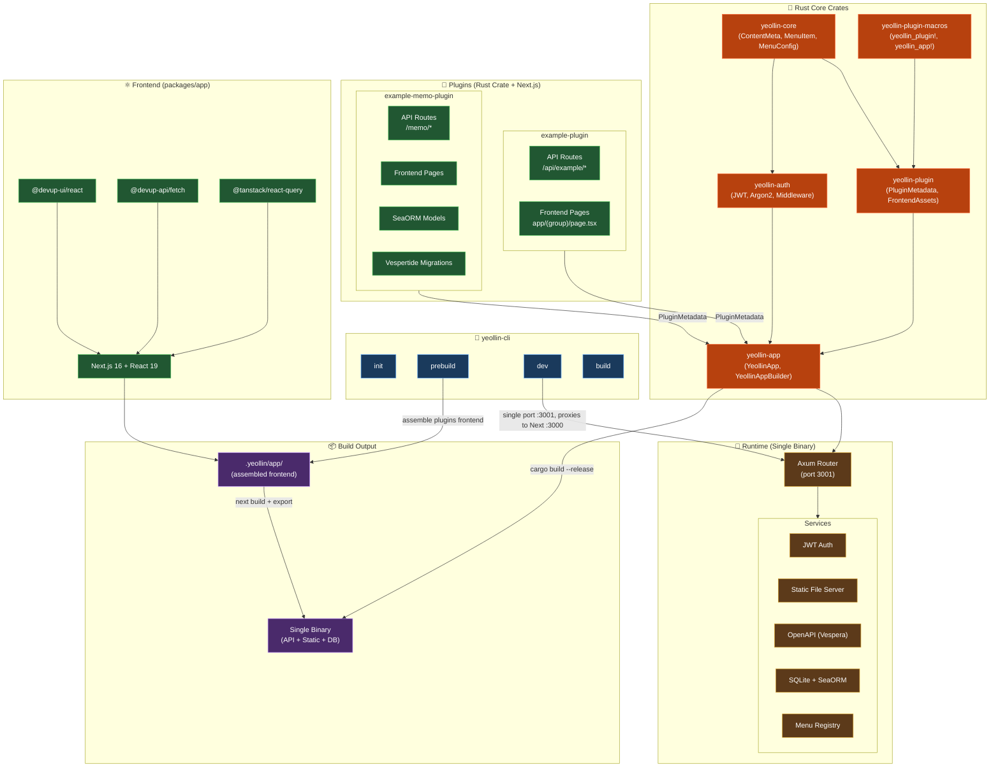

# Yeollin CMS Architecture

Rust + Next.js plugin-based CMS framework. Plugins bundle API routes and frontend
pages in a single crate; `yeollin-cli` assembles them into one binary that serves
both the API and the statically exported frontend.

## Build flow

1. `cargo build` — produces a binary that can export plugin/menu metadata via
   `YEOLLIN_EXPORT_PLUGINS` / `YEOLLIN_EXPORT_MENUS`.
2. `yeollin prebuild` — extracts the `packages/app` template into `.yeollin/app/`,
   copies each plugin's `app/` pages in, and writes `menus.json` / `plugins.json`.
3. `next build` — static export to `.yeollin/app/out/`.
4. `cargo build --release` — final binary, embedding static files via `include_dir!`.

## Dev mode

`yeollin dev` serves everything on a single port (3001). The Axum router handles
API routes and proxies everything else to the internal Next.js dev server on 3000,
including the Turbopack HMR WebSocket at `/_next/hmr`.
